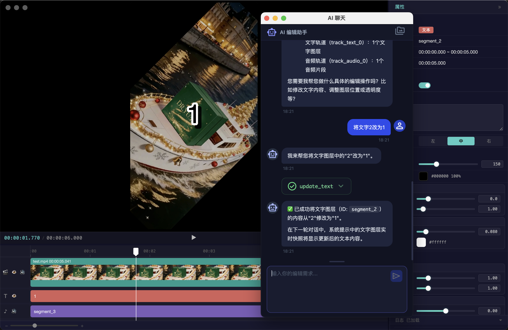

# Electron Video Rendering Engine

**AI 原生的视频编排工作台**：在 Electron 中融合 **LangGraph 智能体**、**工程级持久化** 与 **C++/OpenGL/Skia 实时渲染管线**，让自然语言驱动时间轴、图层与素材——所见即所得，所聊即所改。



---

## 智能编排 · AI Copilot

- **对话即操作**：内嵌基于 **LangGraph** 的编排代理，理解工程上下文，将意图拆解为对图层、文案与素材的可执行变更。
- **流式认知输出**：支持带推理链路的模型；流式响应按 **思考 → 工具调用 → 总结** 分段呈现，避免信息混叠，可读性与可调试性兼备。
- **结构化工具调用 UI**：每一次 `function calling` 以独立卡片展示（工具名、参数、执行状态与结果），人机协作过程**全程可观测**，而非黑盒文本。
- **动态工程上下文**：会话与工程状态联动，代理可读取当前合成树、素材库等结构化信息，减少「幻觉式」编辑建议。

> 技术栈要点：**LangChain / LangGraph**、可插拔 LLM（含思考/推理模式）、**N-API** 桥接原生渲染与前端 UI。

---

## 持久化 · 会话与记忆

- **SQLite Checkpointer**：对话与代理状态落盘至应用数据库（**SqliteSaver**），按 **工程 / 线程 ID（thread_id）** 隔离。
- **跨次打开可续聊**：切换项目即加载对应会话历史；新建工程自动初始化线程，删除工程可同步清理会话图谱。
- **历史与 UI 同源**：Checkpoint 中的 `HumanMessage` / `AIMessage` / `ToolMessage` 经统一序列化层映射为聊天时间线，**持久化记录与界面展示顺序一致**（含思考内容与工具轨迹）。

> 设计目标：**Never break userspace**——状态可恢复、可审计，适合长周期协作与复盘。

---

## 渲染性能 · 毫秒级合成

| 维度 | 说明 |
|------|------|
| **合成一帧** | 典型负载下，多图层 OpenGL 离屏合成 **约 0.4 ms/帧**，为实时预览与批处理留出余量。 |
| **GPU 硬件解码** | **H.264 / HEVC** 在 **macOS** 上优先走 **VideoToolbox** 硬解，帧数据以 **CVPixelBuffer** 路径上传纹理，减少 CPU 色彩转换与 memcpy 压力。 |
| **GPU 文字** | **Skia** 与 **OpenGL** 共享上下文，富文本直接绘制至 **FBO**，与视频纹理同一合成管线。 |
| **异步预取** | 后台预渲染下一帧，顺序播放缓存命中率高，交互拖拽时首帧可接受、后续快速跟上。 |

---

## 核心能力一览

- **多轨道时间轴**：类 After Effects 的非线性编排，视频 / 文本 / 音频分层管理。
- **富文本引擎**：基于 Skia **skparagraph**，字间距、行高、多重描边、逐 run 阴影。
- **离屏 OpenGL**：FBO + 纹理混合，无需依赖可见窗口即可完成成片帧输出。
- **OOP N-API**：`ObjectWrap` 映射 `Root` / `Layer`，多实例、generation 校验，杜绝野指针泄漏到 JS。
- **零拷贝倾向**：渲染结果写入 `ArrayBuffer` 直出 JS，降低冗余拷贝。

---

## 架构鸟瞰

```
┌─────────────────────────────────────────────────────────────┐
│  Electron 前端 · 时间轴 / 预览 / 聊天                        │
│  AI：流式消息 · 工具卡片 · 会话历史                            │
└───────────────────────────┬─────────────────────────────────┘
                            │  IPC / N-API
┌───────────────────────────▼─────────────────────────────────┐
│  Agent 层（LangGraph + SqliteSaver）                          │
│  thread 隔离 · checkpoint 持久化 · 工具调用闭环                │
└───────────────────────────┬─────────────────────────────────┘
                            │
┌───────────────────────────▼─────────────────────────────────┐
│  C++ 渲染引擎                                                │
│  RootNode 合成 → VideoLayer(Texture+HW 解码) + TextLayer(Skia) │
│  → FBO → 像素回传 JS                                         │
└─────────────────────────────────────────────────────────────┘
```

---

## 构建与运行

```bash
# macOS 依赖示例
brew install cmake ffmpeg pkg-config

npm install
npm run build
npm start
```

配置 **LLM**（如 `OPENAI_API_KEY`、方舟/兼容端点等）于项目环境变量后，即可使用内置智能助手；数据库与 checkpoint 由应用自动维护。

### 渲染 API 示例

```javascript
const { createRoot, getVideoInfo } = require('./build/Release/video_player');

const root = createRoot();
root.init();
root.load(JSON.stringify(config));

const layers = root.getLayers();
root.setCurrentTime(5000);
const pixels = root.draw();
root.cleanup();
```

---

## 技术矩阵

| 领域 | 实现 |
|------|------|
| AI 编排 | LangGraph、流式 messages、工具绑定与结构化回调 |
| 持久化 | SqliteSaver、thread 级 checkpoint、历史序列化 |
| 视频解码 | FFmpeg；H.264/HEVC → VideoToolbox（macOS） |
| 合成 | OpenGL FBO、纹理混合、硬件帧直传纹理 |
| 文字 | Skia skparagraph、GPU 直绘 |
| JS 绑定 | N-API ObjectWrap、generation 安全 |

---

## 交流

欢迎加入 **QQ 交流群**，群号：**523219063**。在 QQ 中搜索该群号即可加入，交流渲染管线、AI 编排与工程实践。

---

## License

MIT
