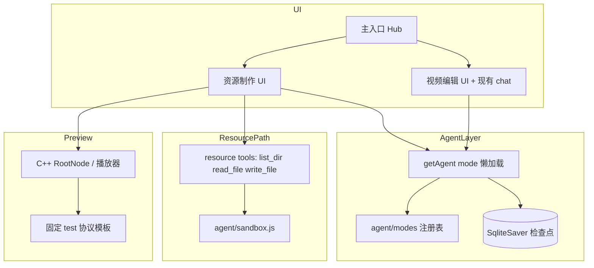

# 渲染资源 Agent 设计规格

> **文档类型**: 产品 + 技术需求规格（PRD/TRD 混合）  
> **目标读者**: 实现工程师、代码审查、大模型辅助开发  
> **最后更新**: 2026-05-23  
> **实现状态**: 核心功能已落地（见各节 `status` 字段）

---

## 0. 元数据（供 LLM / 工具链解析）

```yaml
project: electron-rendering
feature: resource_creation_agent
related_code:
  - agent/index.js          # 多 mode Agent 入口、thread_id、流式聊天
  - agent/modes/index.js    # mode 注册表
  - agent/modes/resource.js # 渲染资源 mode（工具 + system prompt）
  - agent/modes/editor.js   # 视频编辑 mode
  - agent/sandbox.js        # RESOURCE_SANDBOX 读写边界
  - chat/                   # 现有聊天 UI（当前仅服务 editor）
  - resource_ui/index.html         # 资源制作 UI 主页（三栏布局）
  - resource_ui/resource_ui.js     # 左栏 + 预览播放器 + 挂载逻辑
  - resource_ui/preview_protocol.js  # PREVIEW_PROTOCOL 常量 + resolvePreviewPaths
env:
  RESOURCE_SANDBOX: "./test/resources"   # 资源写入根目录（.env）
  OPENAI_API_KEY / OPENAI_BASE_URL / OPENAI_MODEL_NAME
modes:
  editor:   { label: 视频编辑, thread_prefix: "editor:" }
  resource: { label: 渲染资源, thread_prefix: "resource:" }
default_mode: editor
```

---

## 1. 问题陈述

在 Electron 视频编辑器中，增加**聊天式渲染资源生产**能力：用户通过自然语言描述，由大模型编写 GLSL Shader 与 `config.json`，在沙箱目录生成可加载的 effect / transition 资源，并能在**固定预览工程**上实时验证。

与现有「视频编辑 Agent」共用聊天基础设施，但业务隔离、UI 分区、工具集不同。

---

## 2. 目标与非目标

### 2.1 目标（Must Have）

| ID | 描述 | status |
|----|------|--------|
| G1 | 复用聊天链路：历史持久化、流式输出、上下文压缩、Tool 调用展示 | `done` — resource_ui/index.html 内嵌 chat.js，完整复用 |
| G2 | 入口分流：主 UI 选择「资源制作」或「视频编辑」 | `done` — home/index.html Tab 已实现 |
| G3 | 会话 ID 带 mode 前缀，历史按业务筛选，**不考虑旧数据迁移** | `done` — 格式为 `{mode}:{uuid}`，见 §4 |
| G4 | Agent 可扩展：非单例，按 mode 注册；支持动态 system prompt | `done` — editor 用 middleware；resource 为静态 prompt |
| G5 | 资源制作专用布局：左资源列表 / 中预览 / 右聊天 / 下播放控制 | `done` — resource_ui/index.html + resource_ui.js |
| G6 | 预览使用前端写死的双 segment 单轨道协议（`PREVIEW_PROTOCOL`）；创作中自动挂载资源并回传错误 | `done` — preview_protocol.js + auto-mount + `_notifyChatLoadError` |
| G7 | LLM 工具：ls、read、write（仅沙箱）、查询；写路径以工程名为根 | `done` — 工具已有，auto-mount 钩子已加入 write_file |

### 2.2 非目标（Out of Scope）

- 多轨道预览、完整时间线编辑（归 editor mode）
- 历史会话从旧无前缀格式自动迁移
- 资源发布到生产 CDN / 版本管理
- 非沙箱路径的任意写入

---

## 3. 术语表

| 术语 | 含义 |
|------|------|
| **mode** | Agent 业务类型：`editor`（视频编辑）或 `resource`（渲染资源） |
| **thread_id** | LangGraph 检查点键，格式 `{mode}:{uuid}`，例如 `resource:a1b2c3` |
| **uuid** | 前端生成的会话/项目裸 ID，不含 mode 前缀 |
| **沙箱 (sandbox)** | `RESOURCE_SANDBOX` 解析后的绝对目录；**写**仅限其内 |
| **资源工程 (res)** | 沙箱下的子目录，含 `config.json` + `shaders/` |
| **预览协议 (`PREVIEW_PROTOCOL`)** | 资源制作 UI 内**前端写死的 JSON 对象**（非磁盘文件）；双 video segment + effect/transition 挂载点 |
| **自动挂载** | 资源写入后，预览播放器自动替换 materials 并加载，失败则错误回传聊天 |

---

## 4. 系统架构

### 4.1 高层组件



### 4.2 Mode 与 thread_id 规范

**已实现**（`agent/index.js`）：

```javascript
// resolveThreadId(uuid, mode) => `${mode}:${uuid}`
// 合法 mode: "editor" | "resource"
```

| 业务 | mode 值 | thread_id 示例 | 说明 |
|------|---------|----------------|------|
| 视频编辑 | `editor` | `editor:550e8400-e29b-...` | 原主 UI + chat |
| 渲染资源 | `resource` | `resource:550e8400-e29b-...` | 新资源制作 UI |

> **与初稿差异**：初稿写 `video_editor-xxx` / `resource_create-xxx`；实现采用 `editor:` / `resource:` 前缀且无连字符 UUID 拼接。**以代码为准**，新 UI 生成 uuid 后传 `mode` 即可。

历史列表 API：`getHistory(uuid, mode)`、`deleteThread(uuid, mode)` — 按 mode 天然隔离。

---

## 5. Agent 抽象设计（重点）

### 5.1 设计原则

1. **无单例 Agent**：`agents[mode]` 懒加载，各 mode 独立 `systemPrompt` / `tools` / `middleware` / `stateSchema`。
2. **零特殊分支的 thread_id**：所有 mode 统一 `resolveThreadId`，不在业务层散落字符串拼接。
3. **动态 system prompt**：通过 `createMiddleware` + `dynamicSystemPromptMiddleware` 在**每次模型调用前**注入快照（editor 已实现）。

### 5.2 Mode 模块契约

每个 mode 文件必须导出：

```typescript
interface AgentModeDefinition {
  id: string;                    // 注册键，如 "resource"
  label: string;                 // UI 显示名
  systemPrompt: string | (() => string | Promise<string>);  // 静态或工厂
  createTools: () => Tool[];
  stateSchema?: ZodObject;       // 可选，LangGraph 状态扩展
  createMiddleware?: (ctx: { getResourcesState }) => Middleware[];  // 可选
}
```

新增 mode：在 `agent/modes/index.js` 注册一行即可。

### 5.3 systemPrompt 策略

| mode | 策略 | status |
|------|------|--------|
| `resource` | 静态 `SYSTEM_PROMPT`（shader + config 契约） | `done` |
| `editor` | 静态基础 prompt + middleware 追加工程协议/素材库 | `done` |
| 未来 mode | 推荐：`systemPrompt` 函数 + 可选 `createMiddleware` | `design` |

**resource mode 可选增强**（未实现）：middleware 注入「当前预览挂载的资源路径」「最近一次 load 错误」，便于模型根据运行时反馈改 shader。

### 5.4 默认能力（所有 mode 共享）

- LangGraph `SqliteSaver` 检查点（`db`）
- 流式 `handleUserMessage`：thinking / token / toolCall / toolResult / segmentBreak
- 上下文压缩：由 LangChain agent 默认 middleware 栈处理（与 editor 一致）

---

## 6. 资源制作 UI

### 6.1 入口 Hub

```
┌─────────────────────────────────────┐
│         选择工作区                   │
│  [ 资源制作 ]    [ 视频编辑 ]        │
└─────────────────────────────────────┘
         │                    │
         ▼                    ▼
   resource UI           现有主 UI + chat
   mode=resource         mode=editor
```

- 两个入口**各自维护历史**（同一套 API，不同 `mode`）。
- 新建会话：前端 `crypto.randomUUID()` → `initThread(uuid, mode)`。

### 6.2 资源制作布局（目标）

```
┌──────────┬────────────────────────────┬──────────┐
│ 资源列表  │      预览画布 (Player)      │  AI 聊天  │
│ (沙箱 ls)│                            │          │
│          │                            │          │
├──────────┴────────────────────────────┴──────────┤
│              播放控制条 (时间 / 播放)              │
└──────────────────────────────────────────────────┘
```

| 区域 | 行为 |
|------|------|
| 左栏 | 列出沙箱下资源工程；点击条目 → 预览挂载（见 §6.4） |
| 中栏 | WebGL/Native 播放器渲染当前预览协议 |
| 右栏 | 复用 `chat/` 组件逻辑，`mode: 'resource'` |
| 底栏 | 播放/暂停、seek、总时长（跟预览协议 `duration`） |

### 6.3 预览协议（前端写死常量）

**约定**：预览工程协议**不**从仓库 JSON 文件（如 `test/test.json`）加载；在**资源制作 UI 的渲染进程**内以常量对象写死，启动预览时整包传给 Native 播放器。

| 项 | 规则 |
|----|------|
| 定义位置 | `resource_ui/preview_protocol.js` |
| 导出符号 | `PREVIEW_PROTOCOL`（完整工程 JSON 对象）、`resolvePreviewPaths(protocol, appRoot)`（把相对 `path` 解析为绝对路径） |
| 加载时机 | `resource_ui.js` 的 `initPlayer()` 完成后立即调用 `loadCurrentProtocol()` |
| 禁止行为 | 运行时 `readFile('test/test.json')`、从 editor 工程路径复用协议文件 |
| 变更方式 | 改预览布局只改前端常量并重新发布 UI，**不**改 Agent / 沙箱 / LLM 工具 |

**预览媒体文件**：

- 当前默认使用 `test/test.mp4`（开发阶段占位）；常量中以**相对应用根的路径**写死，`resolvePreviewPaths` 在传给 Native 前解析为绝对路径。
- 正式发布时替换为 `resource_ui/assets/preview.mp4`（打包进 `extraResources`），只需修改 `PREVIEW_PROTOCOL.materials.videos[0].path`。

**结构约定**（已在 `resource_ui/preview_protocol.js` 实现）：

- 单条 **video** 轨道
- **恰好 2 个 segment**，共用同一 `material_video_0`
- `segment_0`：`extra_material_refs` 挂 **transition**（两段之间）
- `segment_1`：`extra_material_refs` 挂 **effect**（第二段画面）
- `materials.effects[]` / `materials.transitions[]` 运行时各最多 **1** 条（由 §6.4 挂载逻辑维护）
- 预览视频路径写在常量内，由 `resolvePreviewPaths` 在传给 Native 前解析（见下）

**`PREVIEW_PROTOCOL` 规范正文**（实现时原样写入 JS 常量，本文档即唯一规格来源）：

```javascript
// resource_ui/preview_protocol.js — 示例，路径/时长可按产品调整
export const PREVIEW_PROTOCOL = {
  id: 'resource_preview',
  duration: 6000,
  fps: 30,
  canvas_config: { width: 720, height: 1280, ratio: '16:9' },
  materials: {
    videos: [
      {
        id: 'material_video_0',
        name: 'preview',
        path: 'assets/preview.mp4',   // 相对应用根或 resource_ui 目录，由 resolvePreviewPaths 解析
        type: '',
      },
    ],
    effects: [],
    transitions: [],
  },
  tracks: [
    {
      id: 'track_video_0',
      type: 'video',
      muted: false,
      visible: true,
      segments: [
        {
          id: 'segment_0',
          material_id: 'material_video_0',
          visible: true,
          muted: false,
          extra_material_refs: [],    // 运行时填入 transition material id
          source_timerange: { start: 0, duration: 5000 },
          target_timerange: { start: 0, duration: 5000 },
        },
        {
          id: 'segment_1',
          material_id: 'material_video_0',
          visible: true,
          muted: false,
          extra_material_refs: [],    // 运行时填入 effect material id
          source_timerange: { start: 0, duration: 1000 },
          target_timerange: { start: 5000, duration: 1000 },
        },
      ],
    },
  ],
};

/** 将 materials.videos[].path 等相对路径转为 Native 可读的绝对路径 */
export function resolvePreviewPaths(protocol, appRoot) {
  // 返回深拷贝 + 解析后的 path，不修改导出的常量
}
```

**预览媒体文件**：

- 与协议常量**同在前端侧约定**：例如 `resource_ui/assets/preview.mp4`（或打包进 `extraResources`）
- `path` 字段在常量里用**相对路径**；`resolvePreviewPaths` 基于 `app.getAppPath()` / `__dirname` 解析后再 `loadProject`
- 与 `test/test.mp4` **无耦合**；仓库 `test/` 目录仅作开发参考，**不得**被资源预览运行时依赖

### 6.4 资源挂载规则

| 规则 | 说明 |
|------|------|
| 点击左栏资源 | 根据 `config.json` 的 `format` 字段判断 `effect` / `transition` |
| 替换策略 | 挂载新资源前，**先清空**同类型已有 material（effects 或 transitions 数组） |
| 并发上限 | 同时最多 1 个 effect material + 1 个 transition material |
| 创作中默认挂载 | LLM `write_file` 写入 `config.json` 完成后，**自动**尝试挂载到预览；失败则将 C++ `load` 错误注入聊天上下文 |
| 创作完成可选挂载 | 用户可从左栏手动点击切换资源 |

**自动挂载反馈回路（已实现）**：

```
write_file 写入 config.json 成功
    → window.__onResourceWritten(absPath) 被调用（resource.js）
    → resource_ui.js 解析 config.json 拿到 format、name
    → mountResource(item) → loadCurrentProtocol()
    → 失败: _notifyChatLoadError({ stage, path, message }) → 聊天区注入 warning 气泡
    → 成功: 刷新左栏高亮 + 预览帧
```

**错误格式约定**（§11.2 缺口已关闭）：

```json
{ "stage": "loadProject", "path": "<folder>", "message": "<C++ 错误字符串>" }
```

### 6.5 播放器 SDK

预览播放器直接在 resource_ui 渲染进程中初始化 C++ addon（`build/Release/video_player`），与 editor 窗口独立。调用链：

```js
// resource_ui/resource_ui.js initPlayer()
preview.addon = require('build/Release/video_player');
preview.root  = preview.addon.createRoot();
preview.root.init();
preview.video = new VideoPlayer(canvas);   // renderer/video/video_player.js

// 加载协议
preview.root.load(JSON.stringify(resolvedProtocol), appRoot)
preview.video.load(preview.root)
preview.video.render(timeMs)
```

**挂载 effect/transition**：通过更新 PREVIEW_PROTOCOL 副本并重新调用 `root.load()` 实现，无需新增 C++ API。材质格式参照 `test/test.json`（已确认）：

```json
// effect 材质
{ "id": "effect_res", "name": "...", "path": "<沙箱绝对路径>", "type": "effect" }

// transition 材质（含 duration）
{ "id": "transition_res", "name": "...", "path": "<沙箱绝对路径>", "type": "transition", "duration": 1000 }
```

---

## 7. LLM 工具与沙箱

### 7.1 环境变量

```bash
# .env
RESOURCE_SANDBOX=./test/resources
```

解析逻辑见 `agent/sandbox.js`：`resolveWritePath` 拒绝 `..` 越界；`resolveReadPath` 允许读任意路径（便于参考源码）。

### 7.2 工具列表（resource mode，已实现）

| 工具名 | 作用 | 写限制 |
|--------|------|--------|
| `list_dir` | 列目录 | 读：任意；相对路径基于沙箱根 |
| `read_file` | 读文本，≤1MB | 读：任意 |
| `write_file` | 写文本，自动 mkdir 父目录 | **仅沙箱内** |

### 7.3 路径 API：初稿 vs 实现

| 初稿 | 当前实现 | 建议 |
|------|----------|------|
| `writefile(resname, filename, str)` | `write_file({ path, content })`，path 如 `my_effect/shaders/pass0.frag` | **保持现有**，在 system prompt 中强调「path = 工程名/相对路径」；或增加薄封装 tool `write_res_file(resname, filename, content)` 内部拼接路径 |

推荐增加（可选）：

```javascript
// 语义化封装，减少模型路径拼接错误
write_res_file({ res: "my_effect", file: "config.json", content: "..." })
// 等价于 write_file({ path: "my_effect/config.json", content })
```

### 7.4 资源工程目录契约（已实现于 prompt）

```
<沙箱根>/<工程名>/
├── config.json
└── shaders/
    ├── pass0.vert
    └── pass0.frag
```

`config.json` 字段契约详见 `agent/modes/resource.js` 内 `SYSTEM_PROMPT`（`format`: `effect` | `transition`，`renderPass`，内外 `uniform` 等）。

---

## 8. 与视频编辑 mode 的边界

| 维度 | editor | resource |
|------|--------|----------|
| 用户目标 | 改字幕、图层属性、时间线 | 写 shader + 资源配置 |
| 工具 | IPC → 编辑器 `update_text` 等 | 文件系统沙箱 |
| 状态扩展 | `resources[]` 素材库 | 无（可后续加 `drafts[]`） |
| 动态 prompt | 工程协议 + 素材库快照 | 静态 shader 指南 |
| UI | 现有 chat + 编辑器 | 新布局 + 预览 |

---

## 9. 验收标准（Acceptance Criteria）

- [x] Hub 可选择 mode，历史列表仅显示对应 `mode` 的会话
- [x] `resource` 会话：`write_file` 能在沙箱创建完整工程并可 `read_file` 验证
- [x] 预览区通过前端 `PREVIEW_PROTOCOL` 常量加载双 segment 协议（不读 `test/test.json`），预览视频路径由 `resolvePreviewPaths` 解析
- [ ] 点击左栏 effect 工程 → 预览 segment_1 显示效果；transition 工程 → segment_0 转场生效（依赖 C++ addon 正确处理 effect/transition 材质，需实机验证）
- [x] 同时仅保留一个 effect + 一个 transition；切换前清空同类型
- [x] `write_file` 写入 config.json 后自动挂载失败时，错误信息出现在聊天中且模型下一轮可继续修改
- [x] 不破坏现有 `editor` mode 行为（回归视频编辑 Agent）

---

## 10. 实现路线图（建议顺序）

1. ~~**预览 IPC + 前端 `PREVIEW_PROTOCOL` 加载**~~ **已完成** — `resource_ui/preview_protocol.js`，不读 `test/test.json`
2. ~~**资源制作 UI 壳**~~ **已完成** — `resource_ui/index.html` + `resource_ui.js`；复用 chat.js，`mode: resource`
3. ~~**左栏沙箱列表 + 点击挂载**~~ **已完成** — `scanSandbox()` + `mountResource()`
4. ~~**write 后自动挂载 + 错误回传**~~ **已完成** — `window.__onResourceWritten` + `_notifyChatLoadError`
5. ~~**Hub 入口 + 历史按 mode 筛选展示**~~ **已完成** — home/index.html Tab 已有
6. （可选）`write_res_file`（语义化封装）、resource middleware 注入预览错误到下一轮 LLM 上下文

---

## 11. 需求文档完备性评审

### 11.1 已足够清晰的部分

- 业务分流（两种 UI / 两种 Agent）
- 聊天能力复用范围
- 沙箱写入安全边界
- 预览区「双 segment、单轨道、effect/transition 互斥」的核心模型
- 资源目录与 `config.json` 契约（已在 `resource.js` prompt 中细化）

### 11.2 缺失或模糊项（建议在编码前补全）

| 缺口 | 影响 | 状态 |
|------|------|------|
| ~~预览用媒体路径~~ | — | **已关闭**：与协议一并写死在 `resource_ui/preview_protocol.js`，见 §6.3 |
| **自动挂载触发点** | 是每个 `write_file` 还是仅 `config.json` 写完 | **已关闭**：以 `config.json` 写入成功为触发；shader 分次写不重复 load |
| **错误回传格式** | 模型能否解析 C++ 错误 | **已关闭**：格式 `{ stage: "loadProject", path, message }`；注入聊天 warning 气泡 |
| **左栏数据源** | ls 沙箱根还是仅含 `config.json` 的子目录 | **已关闭**：仅识别含 `config.json` 的直系子目录为「资源工程」 |
| **上下文压缩策略** | 长 shader 会话是否特殊处理 | 开放：与 editor 共用同一压缩阈值；如有需要可后续加 resource middleware |
| **权限与多用户** | 沙箱是否按 thread 隔离 | 开放：当前为全局沙箱；并发会话写同名工程需用户自行避免（后续可加 uuid 前缀目录） |
| **Hub 与路由** | Electron 哪一层切换 | **已关闭**：home 页 Tab → `ipcRenderer.send('open-project', { type })` → main.js 路由 |
| **命名不一致** | 前后端联调踩坑 | **已关闭**：统一 `editor`/`resource` 前缀 |

### 11.3 总体结论

| 维度 | 评分 | 说明 |
|------|------|------|
| 产品意图 | 🟢 清晰 | 聊天造资源 + 固定预览验证 |
| Agent 架构 | 🟢 已实现 | mode 注册、thread_id、沙箱工具、auto-mount 钩子全部落地 |
| UI/预览 | 🟢 已实现 | 三栏布局、左栏列表、点击挂载、播放控制全部落地 |
| 接口契约 | 🟢 已冻结 | config.json 格式、错误回传格式、挂载触发点均已定义并实现 |
| 可测试性 | 🟡 中等 | 验收清单更新（§9）；effect/transition 实际渲染效果依赖实机验证 |

**结论**：核心功能路线图全部完成。剩余风险点：C++ addon 在资源窗口中 `root.load()` 对 effect/transition 材质的实际渲染行为，需实机跑通「创建 blur effect → 预览生效」端到端用例验证。

---

## 12. 附录：关键代码索引

| 路径 | 职责 |
|------|------|
| `agent/modes/resource.js` | resource mode 工具与 shader/config 契约 prompt；write_file 写 config.json 后调用 `window.__onResourceWritten` |
| `agent/modes/editor.js` | editor mode + 动态工程协议 middleware |
| `agent/index.js` | `resolveThreadId`、`getAgent`、`handleUserMessage` |
| `agent/sandbox.js` | 沙箱根、读写路径解析 |
| `resource_ui/index.html` | 三栏布局 HTML（左：资源列表，中：预览画布，右：聊天，下：播放条） |
| `resource_ui/resource_ui.js` | 左栏扫描 + 预览播放器初始化 + 资源挂载 + auto-mount 钩子 + 错误回传 |
| `resource_ui/preview_protocol.js` | `PREVIEW_PROTOCOL` 常量 + `resolvePreviewPaths` |
| `chat/agent_client.js` | 前端调用 Agent API（接入时传 `mode`） |
| `window/window_manager.js` | `showResourceWindow()` 加载 `resource_ui/index.html`，1400×840 窗口 |

---

## 13. 变更记录

| 日期 | 变更 |
|------|------|
| 2026-05-23 | 由初稿扩展为结构化规格；对齐现有 `editor`/`resource` mode 实现；补充缺口评审与验收标准 |
| 2026-05-23 | §6.3：预览协议改为前端写死常量，不再依赖 `test/test.json` |
| 2026-05-23 | 实现完成：创建 `resource_ui/`（index.html、resource_ui.js、preview_protocol.js）；更新 window_manager 加载新 UI；write_file 增加 auto-mount 钩子；补全所有 §11.2 缺口；更新验收状态 §9 和路线图 §10 |
